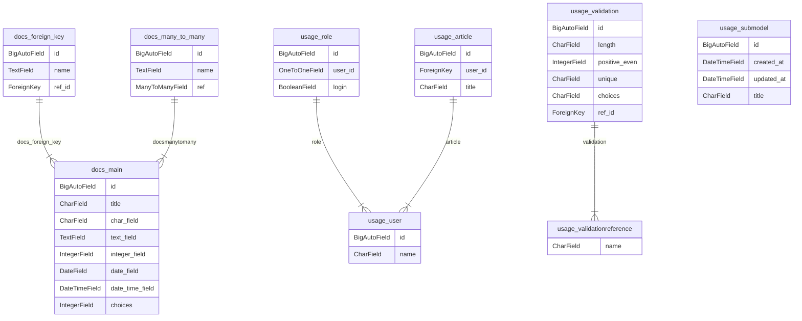

```mermaid
erDiagram
    docs_foreign_key ||--|{ docs_main : docs_foreign_key
    docs_many_to_many ||--|{ docs_main : docsmanytomany
    usage_role ||--|{ usage_user : role
    usage_article ||--|{ usage_user : article
    usage_validation ||--|{ usage_validationreference : validation
    usage_submodel {
        BigAutoField id
        DateTimeField created_at
        DateTimeField updated_at
        CharField title
    }
    docs_main {
        BigAutoField id
        CharField title
        CharField char_field
        TextField text_field
        IntegerField integer_field
        DateField date_field
        DateTimeField date_time_field
        IntegerField choices
    }
    docs_foreign_key {
        BigAutoField id
        TextField name
        ForeignKey ref_id
    }
    docs_many_to_many {
        BigAutoField id
        TextField name
        ManyToManyField ref
    }
    usage_user {
        BigAutoField id
        CharField name
    }
    usage_role {
        BigAutoField id
        OneToOneField user_id
        BooleanField login
    }
    usage_article {
        BigAutoField id
        ForeignKey user_id
        CharField title
    }
    usage_validationreference {
        CharField name
    }
    usage_validation {
        BigAutoField id
        CharField length
        IntegerField positive_even
        CharField unique
        CharField choices
        ForeignKey ref_id
    }
```