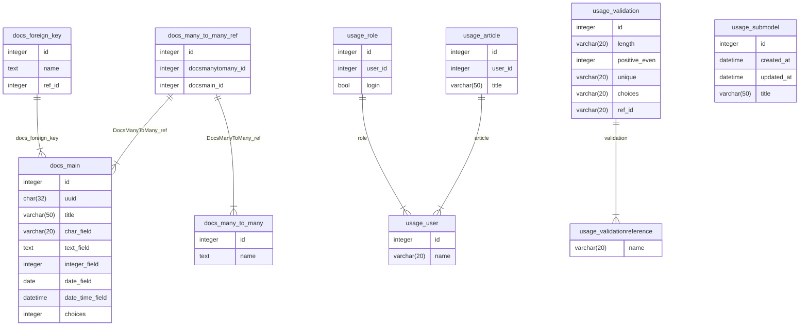

```mermaid
erDiagram
    docs_foreign_key ||--|{ docs_main : docs_foreign_key
    docs_many_to_many_ref ||--|{ docs_many_to_many : DocsManyToMany_ref
    docs_many_to_many_ref ||--|{ docs_main : DocsManyToMany_ref
    usage_role ||--|{ usage_user : role
    usage_article ||--|{ usage_user : article
    usage_validation ||--|{ usage_validationreference : validation
    usage_submodel {
        integer id
        datetime created_at
        datetime updated_at
        varchar(50) title
    }
    docs_main {
        integer id
        char(32) uuid
        varchar(50) title
        varchar(20) char_field
        text text_field
        integer integer_field
        date date_field
        datetime date_time_field
        integer choices
    }
    docs_foreign_key {
        integer id
        text name
        integer ref_id
    }
    docs_many_to_many {
        integer id
        text name
    }
    docs_many_to_many_ref {
        integer id
        integer docsmanytomany_id
        integer docsmain_id
    }
    usage_user {
        integer id
        varchar(20) name
    }
    usage_role {
        integer id
        integer user_id
        bool login
    }
    usage_article {
        integer id
        integer user_id
        varchar(50) title
    }
    usage_validationreference {
        varchar(20) name
    }
    usage_validation {
        integer id
        varchar(20) length
        integer positive_even
        varchar(20) unique
        varchar(20) choices
        varchar(20) ref_id
    }
```